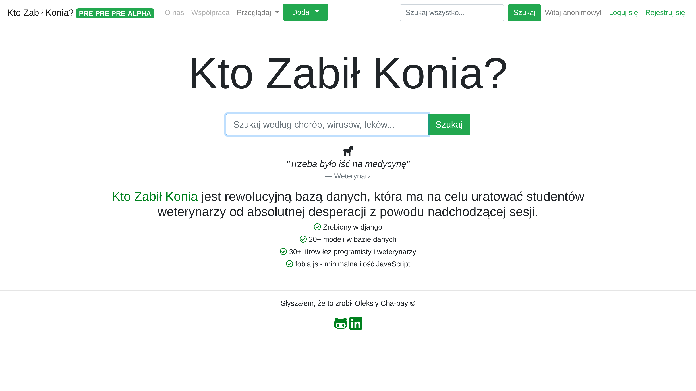

## Who Killed The Horse
A handy library of animal diseases for our ever-suffering veterinarians.

## Motivation
Our main goal is to make it easier for vet students to accumulate the essential knowledge of different animal diseases, medicines and how they are connected. We want to create a platform where it is easy to view and add such data in any given moment, on any given device 

## Build status
Currently we are working on deploying the first alpha version of the website.

## Screenshots

## Tech/framework used

<b>Built with</b>
- Python (3.7.3)
- Django Framework (2.2)
- PostgreSQL
- Bootstrap 4

## Features
- An abbility to add:
  - diseases
  - medicines
  - diagnostics
  - viruses
  - species
  
### We plan to implement:
- Searching via tags and other keywords
- Complex filtering system
- Hyperlink structure
- Exporting chosen data to anki (https://apps.ankiweb.net) flashcards for best learning experience
- API to fetch species and other data from other medical-sources
- And many more!

## Contribute

If you wish to contribute to the project please let us know by writing an emial - chapaykos@gmail.com !

## Credits
Oleksii Filipas - The Vet Guy
Olga Krehlik - The Vet Girl
Oleksiy Chapay - web-development

## License
MIT License
